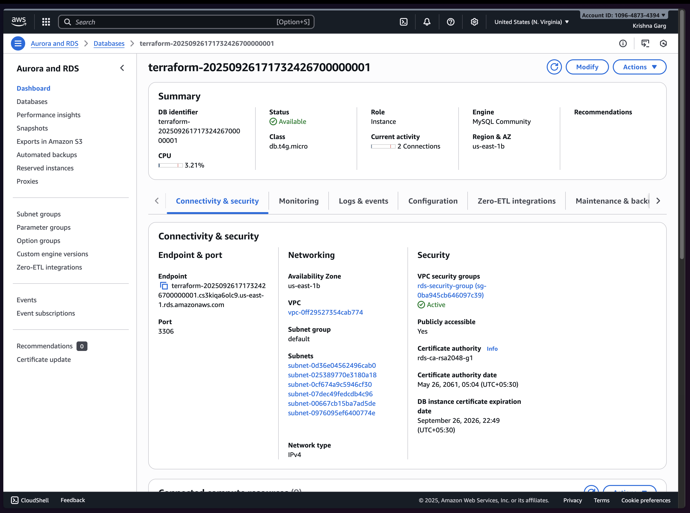

# Deployed Application

Access the deployed application here:
http://k8s-awsdevop-awsdevop-c513c0f1d2-2011707408.us-east-1.elb.amazonaws.com

# Screenshots & Demo

## AWS CloudWatch Dashboard
[View the CloudWatch Dashboard](https://cloudwatch.amazonaws.com/dashboard.html?dashboard=awsdevopsdashboard&context=eyJSIjoidXMtZWFzdC0xIiwiRCI6ImN3LWRiLTEwOTY0ODczNDM5NCIsIlUiOiJ1cy1lYXN0LTFfRkMzSlN0UkdGIiwiQyI6Ijc1Njk3czRldDEyZjB0c2xmdjY3b2ZsMnVwIiwiSSI6InVzLWVhc3QtMTo1MmRiOWNlNi05MDAxLTRmOGUtOGZlOS1mMmIxODQxZTFkY2EiLCJNIjoiUHVibGljIn0=)
# Screenshots & Demo

Add screenshots of your application, CI/CD pipeline, and AWS resources below. You can also embed a demo video (e.g., YouTube link or local file).

## Application UI


## Jenkins Pipeline


## AWS Resources




## Monitoring & Alerts


## Data in RDS


## Demo Video

If you have a local or cloud recording file, you can also link it here
Demo Recording: [aws-devops-demo.mp4](screenrecording.mp4)


---
# AWS DevOps Assignment

This project demonstrates a Node.js sample app deployed on AWS EKS, using MySQL (Aurora) and Redis (Elasticache), with CI/CD via Jenkins and infrastructure managed by Terraform.

## Architecture
- **Backend:** Node.js (Express)
- **Database:** MySQL (Aurora RDS)
- **Cache:** Redis (Elasticache)
- **Containerization:** Docker
- **Orchestration:** Kubernetes (EKS)
- **CI/CD:** Jenkins
- **IaC:** Terraform (EKS, RDS, Elasticache)

## Features
- `/health`: Health check endpoint
- `/trade/place`: Place a trade (stores in MySQL, caches in Redis)
- `/trade/:id`: Get trade by ID (cache-first)
- Simple HTML UI

## Folder Structure
```
sample-app/           # Node.js app (Express)
	app.js
	index.html
	dockerfile
migrations/           # SQL migration files
eks_cluster/          # Terraform for EKS
rds/                  # Terraform for Aurora RDS
elasticcache/         # Terraform for Redis
awsdevopsassignment.yml # Kubernetes manifests
ingress.yaml          # Ingress for ALB
Jenkinsfile           # CI/CD pipeline
.gitignore
README.md
```

## Setup & Deployment

### 1. Infrastructure (Terraform)
Provision EKS, RDS (Aurora MySQL), and Elasticache (Redis) using Terraform in respective folders:
```sh
cd eks_cluster && terraform init && terraform apply
cd rds && terraform init && terraform apply
cd elasticcache && terraform init && terraform apply
```

### 2. Build & Run Locally
```sh
cd sample-app
npm install
node app.js
# Or build Docker image
docker build -t sample-app .
docker run -p 3000:3000 sample-app
```

### 3. Kubernetes Deployment
- Update secrets in `awsdevopsassignment.yml` (base64-encoded values)
- Deploy to EKS:
```sh
kubectl apply -f awsdevopsassignment.yml
kubectl apply -f ingress.yaml
```


## CI/CD Pipeline (Jenkins)
- Stages: Checkout, Build & Test, Docker Build & Push, Update Deployment Image, Rollback
- Credentials: DockerHub (`dockerhub-creds`), kubeconfig (`kubeconfig-creds`)
- See `Jenkinsfile` for details

**Note:** Jenkins is running in Docker on your local machine. Some steps (such as Docker build/push and kubectl commands) may require additional configuration for Docker-in-Docker or mounting your kubeconfig. You may need to adjust the Jenkinsfile or Docker setup to ensure all pipeline steps work as described. The provided pipeline is designed to work in a standard Jenkins environment with the required tools and credentials available.

## API Usage
- Health Check:
	```sh
	curl http://<app-url>/health
	```
- Place Trade:
	```sh
	curl -X POST http://<app-url>/trade/place
	```
- Get Trade by ID:
	```sh
	curl http://<app-url>/trade/<id>
	```

## Notes
- Redis and MySQL connection details are passed via Kubernetes secrets (base64-encoded)
- The app logs API requests and DB operations to the console
- Terraform state files and secrets are excluded via `.gitignore`

## Useful Commands
- Rollback deployment:
	```sh
	kubectl rollout undo deployment/sample-app -n awsdevopsassignment
	```
- Check deployment status:
	```sh
	kubectl rollout status deployment/sample-app -n awsdevopsassignment
	```